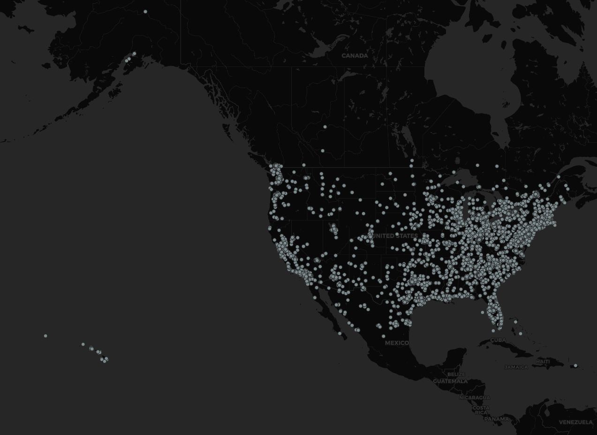

This is a visualization of geotagged public tweets containing the word "election" over the span of 4 hours. It's pretty clear to see that the topic remains quite active even though both the election and inaguration have come and gone simply based on the number of datapoints collected. Obviously tweets come from where people are, so the vast majority of these data points come from population centers with the distribution appearing to resemble that of a general population map, but it does seem to me that some of the more rural areas may be overrepresented such as Montana. What is slightly more interesting are the tweets coming from both Canada and Mexico, especially around the Toronto and Vancouver areas. If I had to guess why it was only these two areas that were especially concentrated it would be because of their proximity to the US, similar to why tweets in Mexico tend to be closer to the US border. 